# Curated List of Data Visualization Podcasts
There are lots of great podcasts coming out these days. I wanted to compile a list of some of the great ones. This list contains only currently running podcasts (atleast 1 episode in the past month). I have also included some tangentially related podcasts that you may find interesting. You can find a Word Cloud Visualization associated with each podcast, which will hopefully give you an idea about the podcast contents. I hope you find this list useful :-)

## Making Data Simple
### Latest Episode: 
 Title:  AI Tools and Runtimes with Shadi Copty [Season 3 - Episode 24]
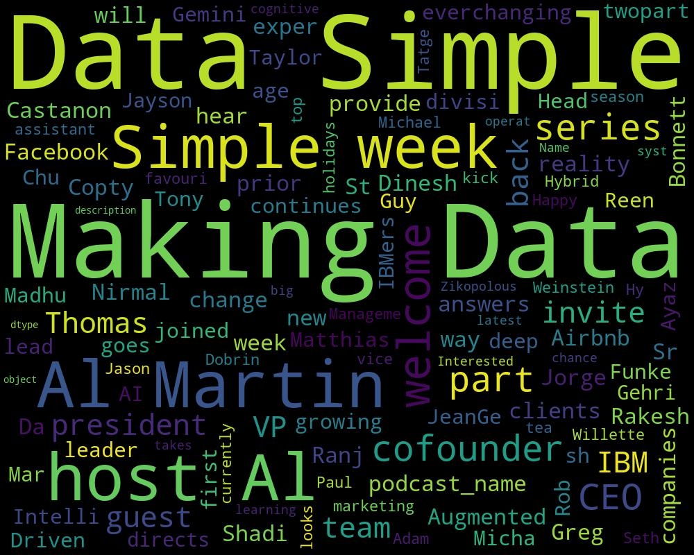

## The Present Beyond Measure Show: Data Visualization, Storytelling & Presentation for Digital Marketers
### Latest Episode: 
 Title:  Presenting Marketing Measurement Effectiveness with Gary Angel
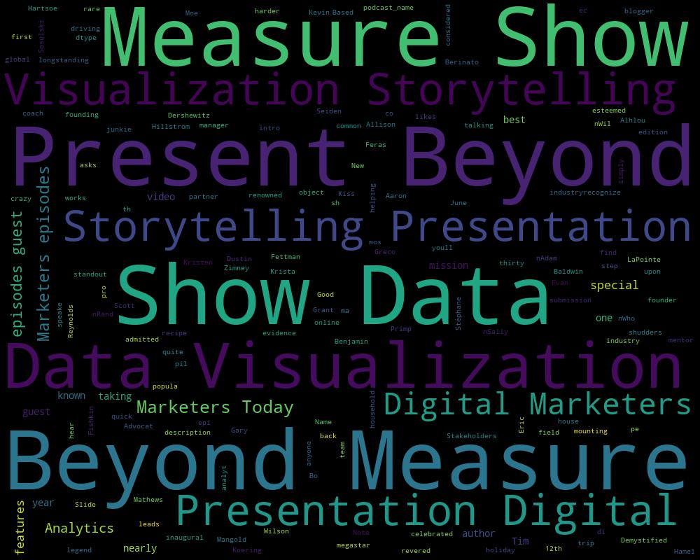

## storytelling with data podcast
### Latest Episode: 
 Title:  storytelling with data: #17 which graph should I use?
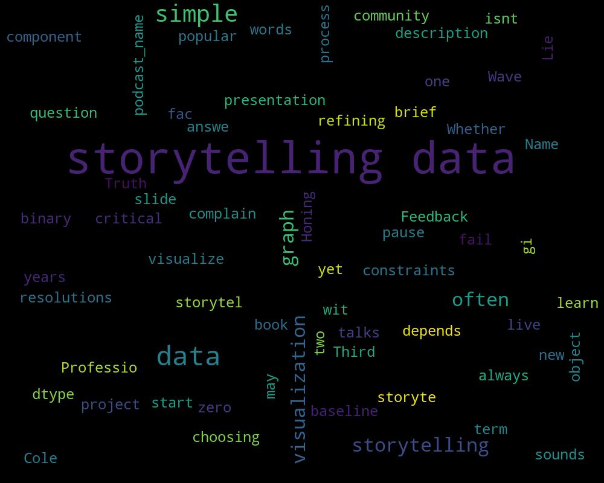

## Data Couture
### Latest Episode: 
 Title:  17. (Data Bites) Bridging the Theoretical and Practical Data Science Divide
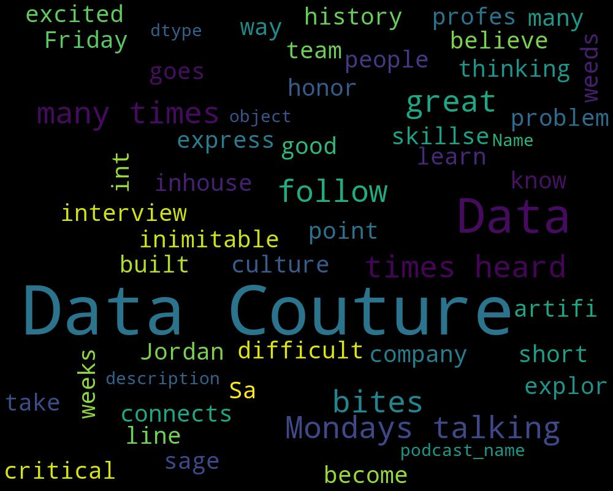

## Analytics on Fire
### Latest Episode: 
 Title:  26: How Silicon Valley startup Hingeto used BI to scale its 7 figure ARR 
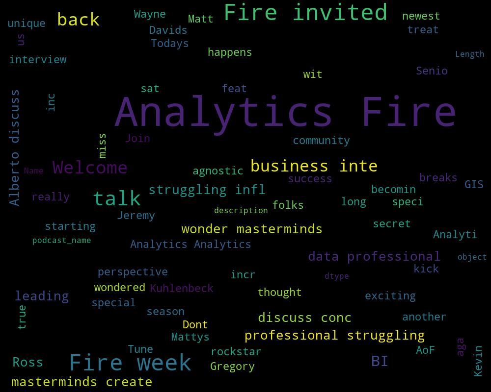

## Workology
### Latest Episode: 
 Title:  Ep 186 – Data Visualization Accessibility for Employees, Teams, & Leaders
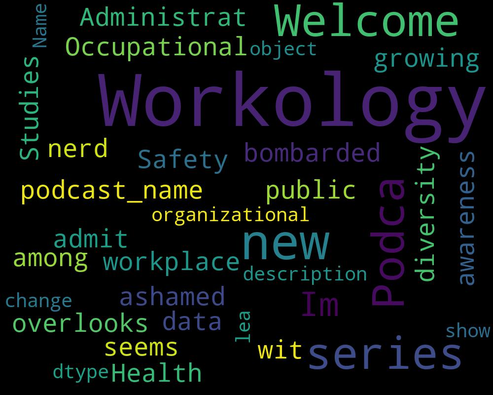

## SuperDataScience
### Latest Episode: 
 Title:  SDS 272: Data Science in Energy
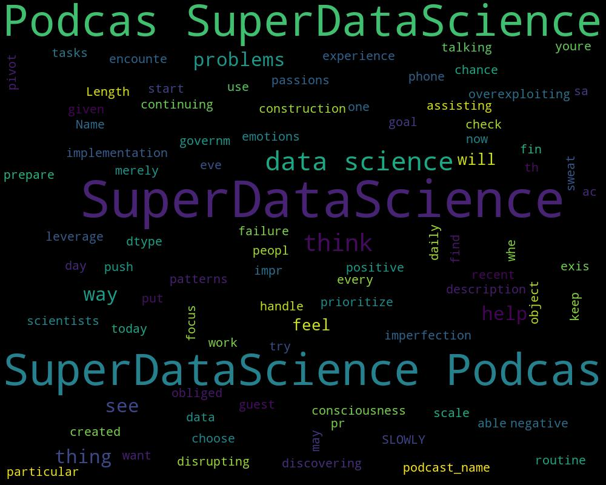

## DevOps Chat
### Latest Episode: 
 Title:  Shift Left for DevOps Security w/ Lacework's Dan Hubbard
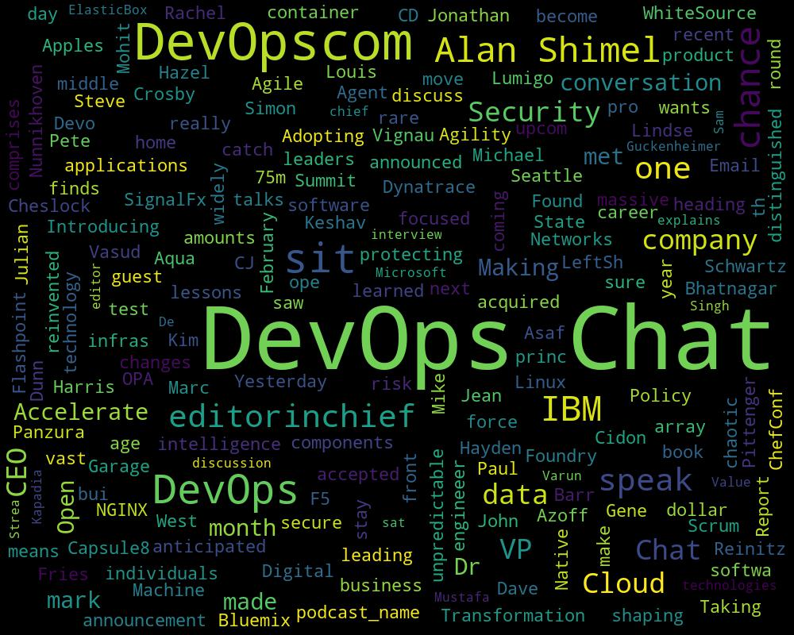

## Platforms Windows, Linux, Apple all the Tech Info you can Handle on the Various Platforms
### Latest Episode: 
 Title:  Google Cloud Platform Podcast: Derwen, Inc. with Paco Nathan
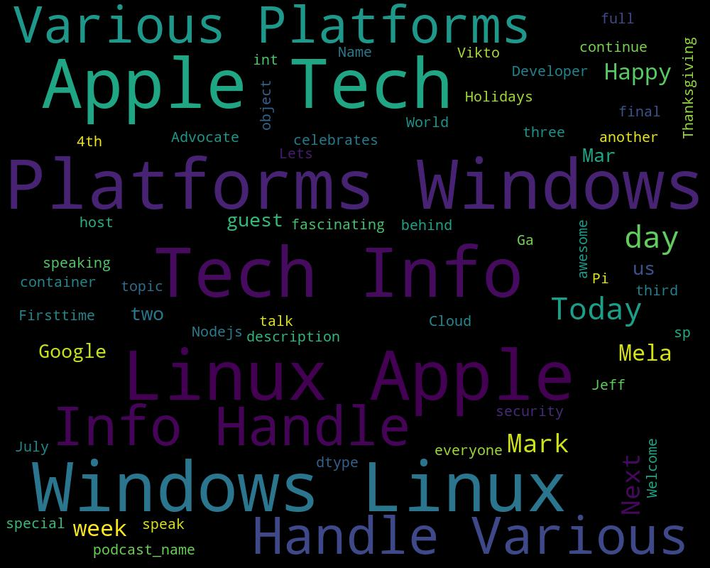

## Practical AI
### Latest Episode: 
 Title:  GANs, RL, and transfer learning oh my!
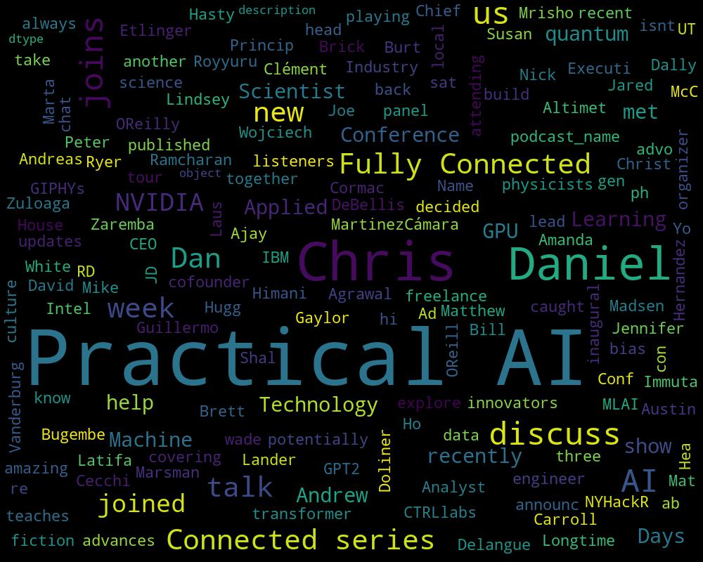

## Changelog Master Feed
### Latest Episode: 
 Title:  Boldly going where no data tools have gone before (The Changelog #350)
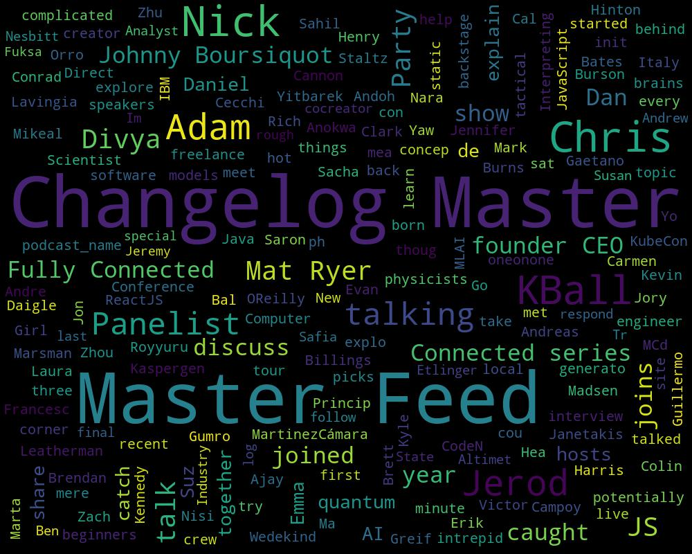

