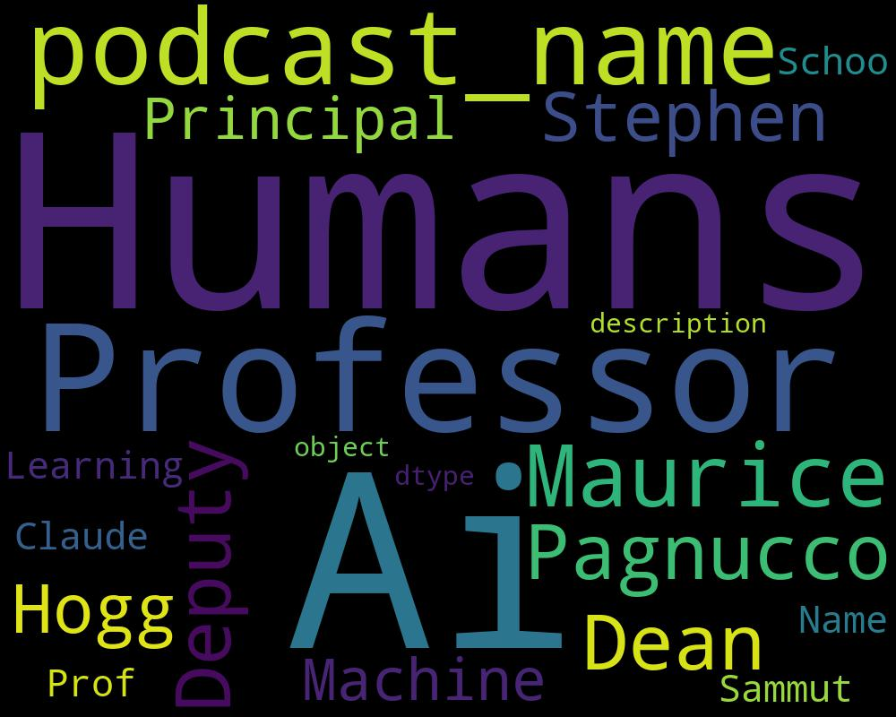

# Curated List of Machine Learning Podcasts
There are lots of great podcasts coming out these days. I wanted to compile a list of some of the great ones. This list contains only currently running podcasts (atleast 1 episode in the past month). I have also included some tangentially related podcasts that you may find interesting. You can find a Word Cloud Visualization associated with each podcast, which will hopefully give you an idea about the podcast contents. I hope you find this list useful :-)

## a16z
### Latest Episode: 
 Title:  a16z Podcast: The History and Future of Machine Learning

## Software Engineering Daily
### Latest Episode: 
 Title:  Niantic Real World with Paul Franceus

## O'Reilly Data Show - O'Reilly Media Podcast
### Latest Episode: 
 Title:  Enabling end-to-end machine learning pipelines in real-world applications

## Microsoft Research Podcast
### Latest Episode: 
 Title:  081 - Game on with Dr. Chris Bishop and Phil Spencer

## The Humans of Ai
### Latest Episode: 
 Title:  Prof Maurice Pagnucco, A brief history of Machine Learning - Expert Systems, Bayesian Methods, Causal Inference and the Millennium Prize.

## The Cloudcast - Cloud Computing
### Latest Episode: 
 Title:  How Lyft Built a Service Mesh with Envoy

## Herding Code
### Latest Episode: 
 Title:  Herding Code 237: Tess Ferrandez on Three Real World Machine Learning Projects

## Data Science at Home
### Latest Episode: 
 Title:  Episode 64: Get the best shot at NLP sentiment analysis

## Merge Conflict
### Latest Episode: 
 Title:  153: Building Machine Learning Robots! 

## Tech Podcast's - Data Science, AI, Machine Learning(BEPEC)
### Latest Episode: 
 Title:  Importance of Markov Chains over Machine Learning
.jpg)

## Cyber Work
### Latest Episode: 
 Title:  How data science and machine learning are affecting cybersecurity

## Device Squad: the Podcast for the Mobile Enterprise
### Latest Episode: 
 Title:  Facial Recognition with John Hershey, Machine Learning Researcher

## Machine Learning – Software Engineering Daily
### Latest Episode: 
 Title:  Niantic Real World with Paul Franceus

## HiveCast
### Latest Episode: 
 Title:  How Machine Learning Will Play a Key Role In Hospitality

## Future Talk
### Latest Episode: 
 Title:  164- Alexa: Delete Everything I Said (12.06.19)

## The New Age of Risk Analytics
### Latest Episode: 
 Title:  What is a Model? And other thoughts with Sonia Sodhi

## TechCrunch Startups – Spoken Edition
### Latest Episode: 
 Title:  Machine learning for everyone startup Intersect Labs launches platform for data analysis

## PHM from Pittsburgh
### Latest Episode: 
 Title:  Machine Learning - Are the Robots taking over? New and Emerging Research Techniques. 

## Classic Business
### Latest Episode: 
 Title:  How elite investors use AI and machine learning to gain an edge

## MacVoices Audio
### Latest Episode: 
 Title:  MacVoices #19176: Michael E. Cohen Talks Take Control of Pages and Take Control of Numbers

## Daily Business Headstart
### Latest Episode: 
 Title:  Waymo Partners with Renault and Nissan, Crate and Barrel Acquires Hudson Grace, Apple Teams up with Best Buy

## brightonSEO's podcast
### Latest Episode: 
 Title:  Jon Quinton - How to Extract Meaningful Data from Facebook Ad Manager

## TEK2day Podcast
### Latest Episode: 
 Title:  Ep. 291: A Conversation about AI with CloudBloom founder Raghav Kamran

## Quantcast – a Risk.net Cutting Edge podcast
### Latest Episode: 
 Title:  Hans Buehler –  28/05/19

## The Trader Cobb Crypto Podcast
### Latest Episode: 
 Title:  Fund Manager Week: Jason Fang

## PNAS Science Sessions
### Latest Episode: 
 Title:  Climate change and global economic inequality

## Castle Super Beast
### Latest Episode: 
 Title:  CSB 022: Edgy Edgy Bishie Bishie Breaky Breaky (For GIRLS)

## SQL Server רדיו
### Latest Episode: 
 Title:  איך אומרים “ביי” באוזבקית

## Intel Chip Chat
### Latest Episode: 
 Title:  Tackling Massive Scientific Challenges with AI/HPC Convergence – Intel® Chip Chat episode 661

## AJNR Podcasts
### Latest Episode: 
 Title:  June 2019 Annotated Bibliography

## Down the Security Rabbithole Podcast
### Latest Episode: 
 Title:  DtSR Episode 351 - Deeper Into the Microsoft Security Ecosystem

## Azure FedHack Podcast
### Latest Episode: 
 Title:  Episode 17 – Chatting with Github – Talking Github Satellite and Microsoft Build

## Eye On A.I.
### Latest Episode: 
 Title:  Episode 17 - Yann Lecun

## Connected Social Media
### Latest Episode: 
 Title:  AI Enhanced Fertility with Presagen and Intel Technology – Intel on AI – Episode 17

## GeekWire
### Latest Episode: 
 Title:  Slack CTO Cal Henderson

## Analytics on Fire
### Latest Episode: 
 Title:  26: How Silicon Valley startup Hingeto used BI to scale its 7 figure ARR 

## Change Wave
### Latest Episode: 
 Title:  Impact: David Yovanno - Collision 2019

## Google Cloud Platform Podcast
### Latest Episode: 
 Title:  Derwen, Inc. with Paco Nathan

## AI with AI
### Latest Episode: 
 Title:  Who Manipulates the Manipulators? (Part 1)

## RBC Disruptors
### Latest Episode: 
 Title:  AI for Good? (June 6, 2019)

## Windows Insider Podcast
### Latest Episode: 
 Title:  Quantum Leaps and Windows Updates

## AWS Podcast
### Latest Episode: 
 Title:  #316: Exploring AWS Lake Formation

## AnalyticsToday Podcast
### Latest Episode: 
 Title:  44: How to Transform Your Marketing Funnel Using Content Consumption Data with Nick Edouard

## Big Data Beard
### Latest Episode: 
 Title:  Microsoft's Azure AI Announcements with Eric Boyd

## Channel 9
### Latest Episode: 
 Title:  An introduction to Azure Tips and Tricks | Azure Friday

## The Data-Driven Marketer
### Latest Episode: 
 Title:  7: The ‘Data Whisperer’ Has Advice on Convincing Execs to Care More About Data Quality

## The Edtech Podcast
### Latest Episode: 
 Title:  #155 - Why you need more sleep, bleeding edge tech in Singapore and two mission-driven & globe trotting educators sharing the mic

## The Banana Data Podcast
### Latest Episode: 
 Title:  BDN #4: The future of data according to predictions, Python 3.0, and people.

## Cyber Security Weekly Podcast
### Latest Episode: 
 Title:  Episode 157 - Keeping thousands of staff cyber aware - Phil Hall, Cyber Security Awareness and Intel Manager with AMP

## Practical AI
### Latest Episode: 
 Title:  GANs, RL, and transfer learning oh my!

## 10 on Tech
### Latest Episode: 
 Title:  054 – You Can’t Trust Anyone!

## Event Tech Podcast
### Latest Episode: 
 Title:  The Advent of Meeting Automation for Events

## DataLab: The Materials Informatics Podcast
### Latest Episode: 
 Title:  009 Mayor of Pittsburgh Bill Peduto - Building a Technology Hub for All

## The Smart Community Podcast
### Latest Episode: 
 Title:  Citizenship, Democracy and Data in the Smart Community (Part 1), with Cornelia Levy-Bencheton and Mike Barlow

