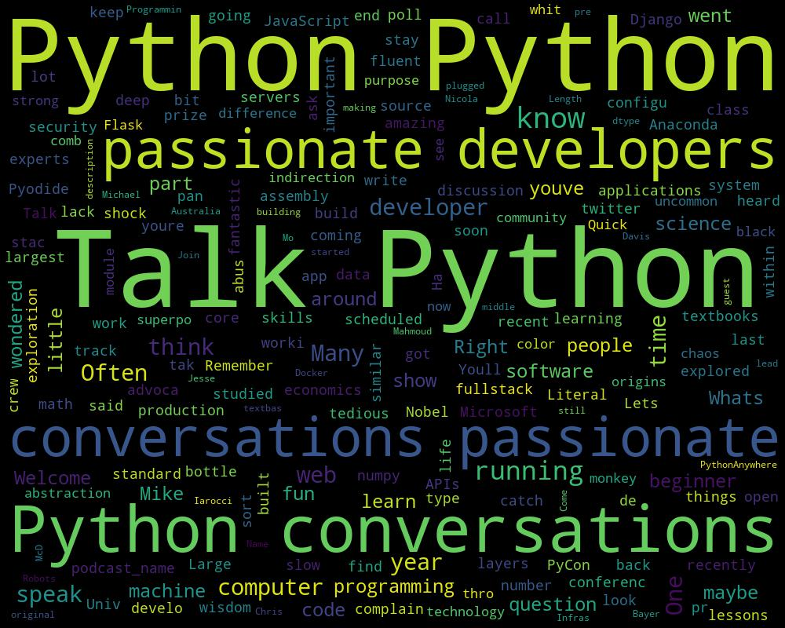
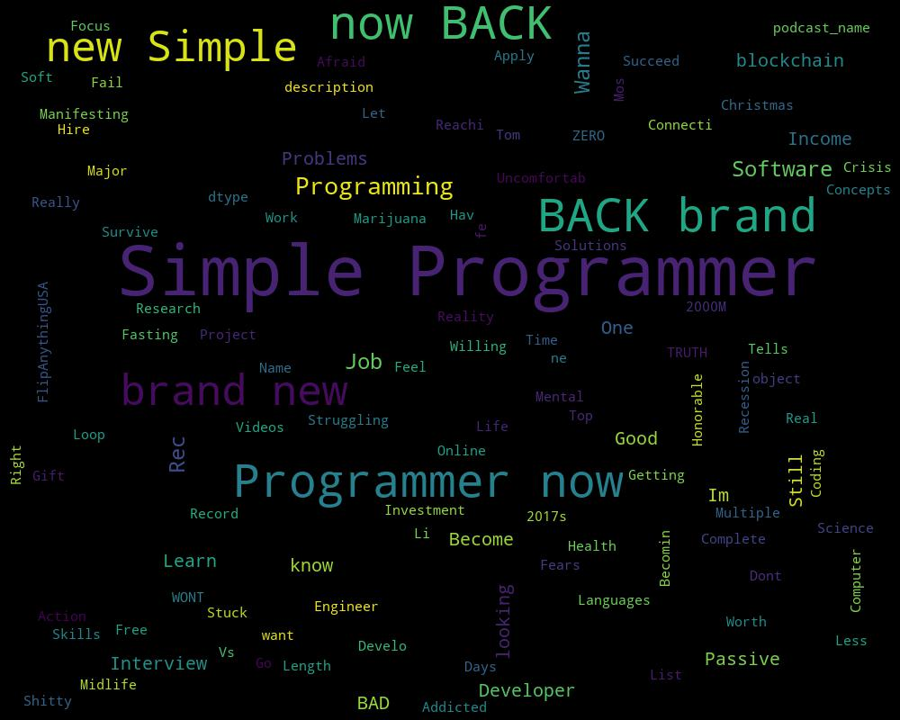
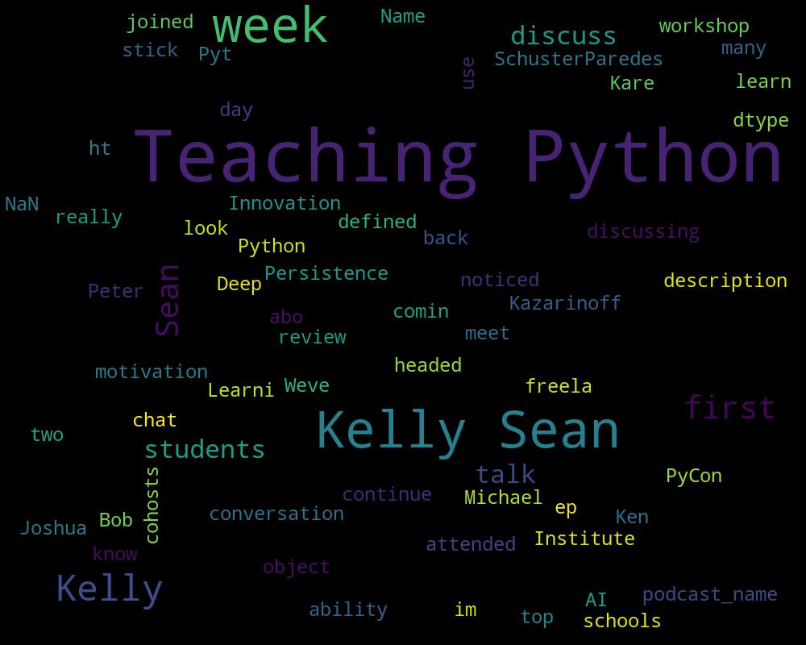
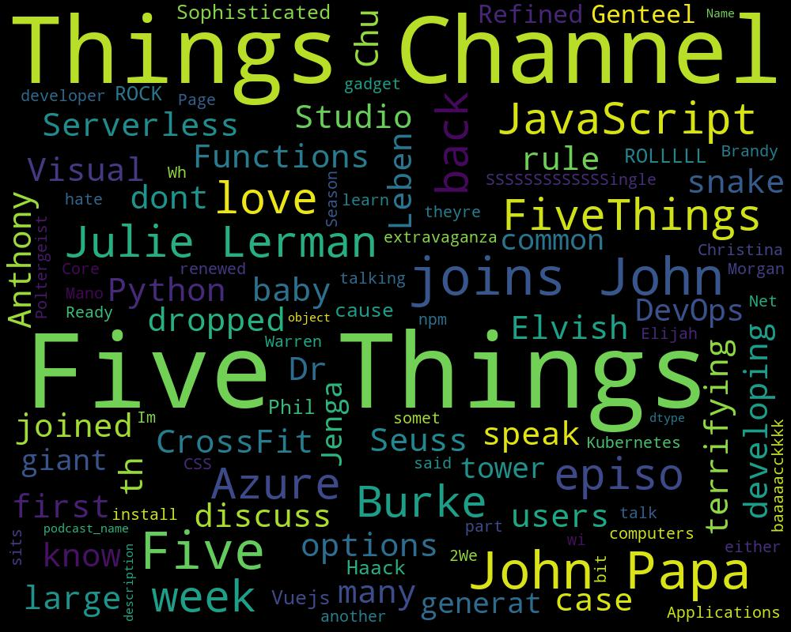
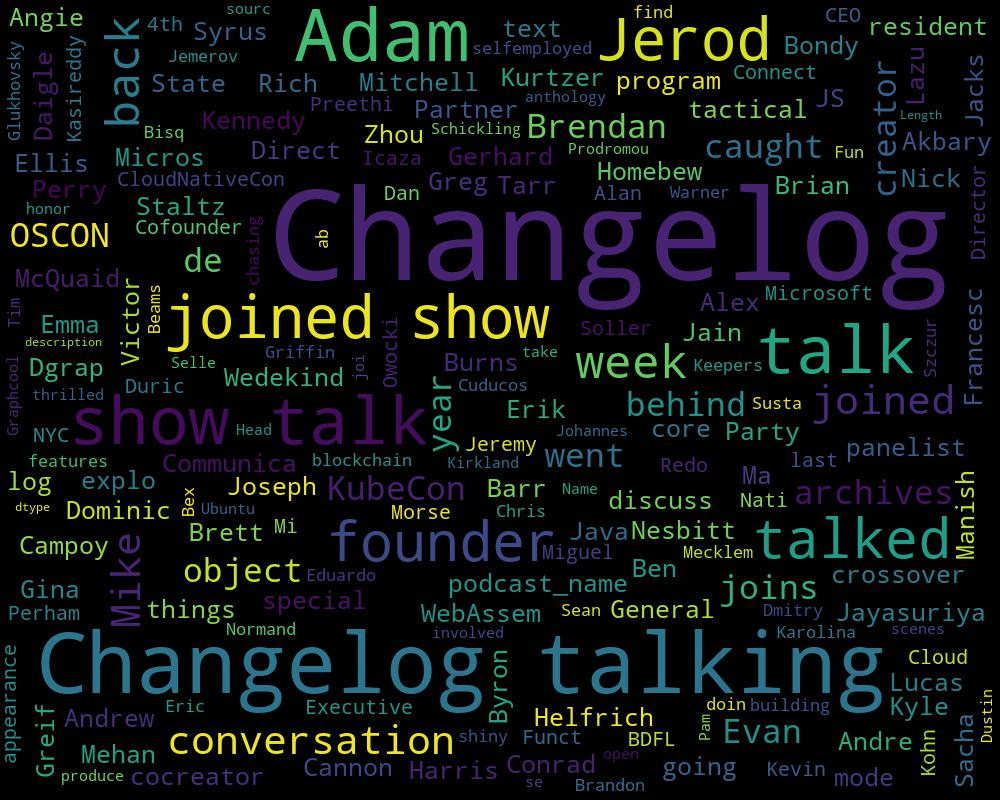
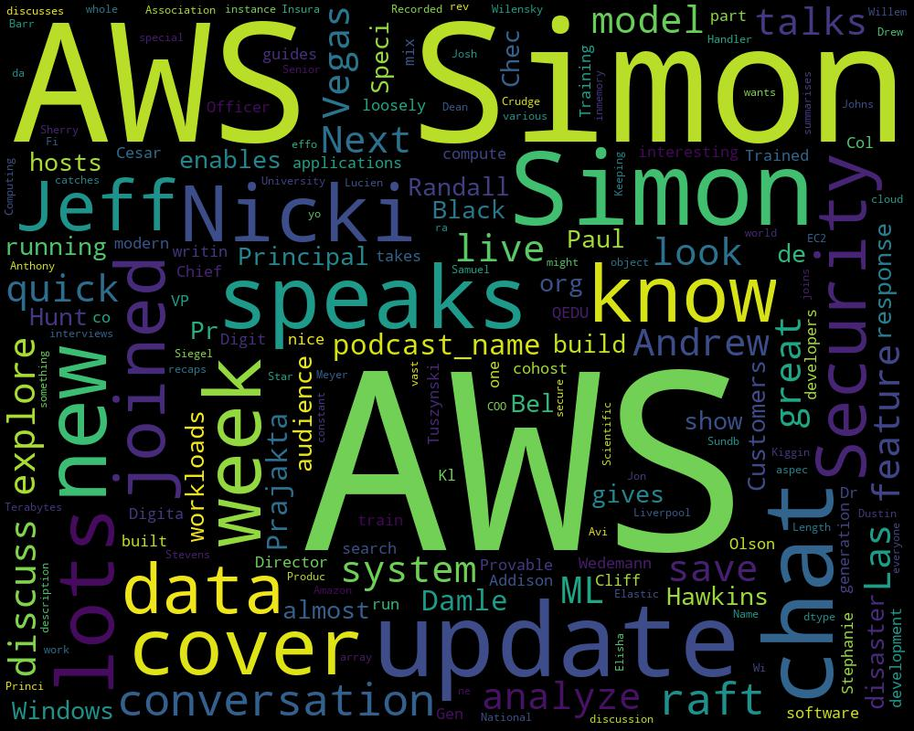
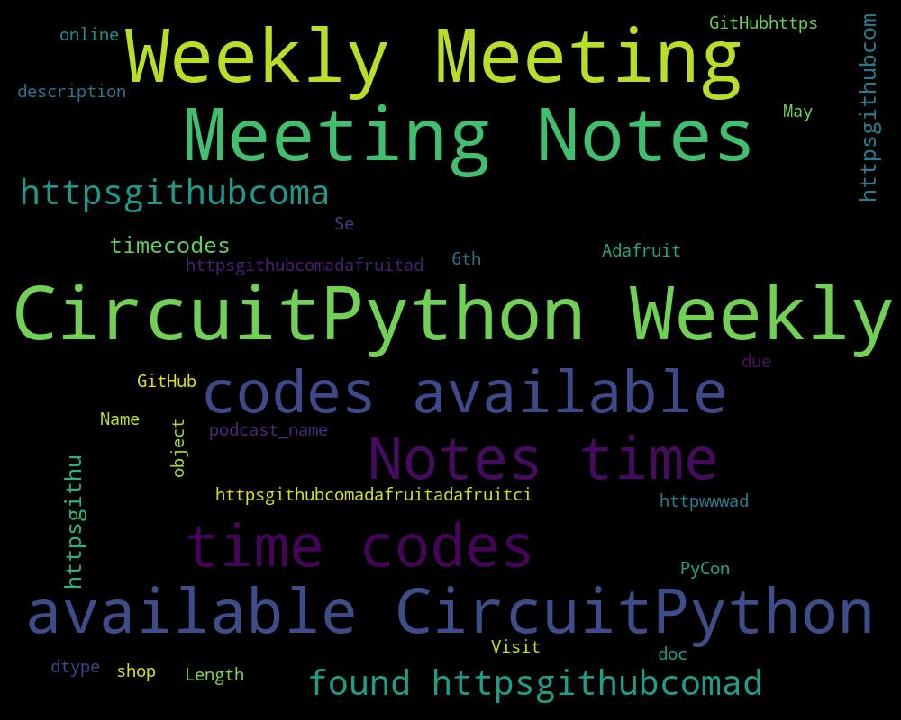
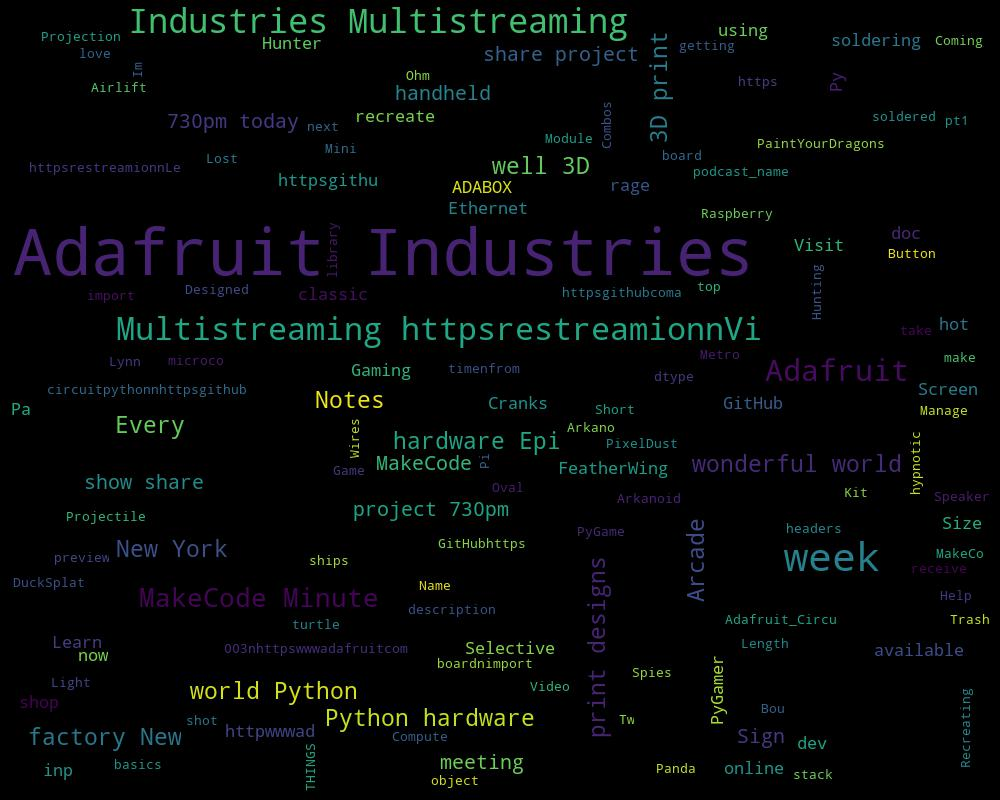
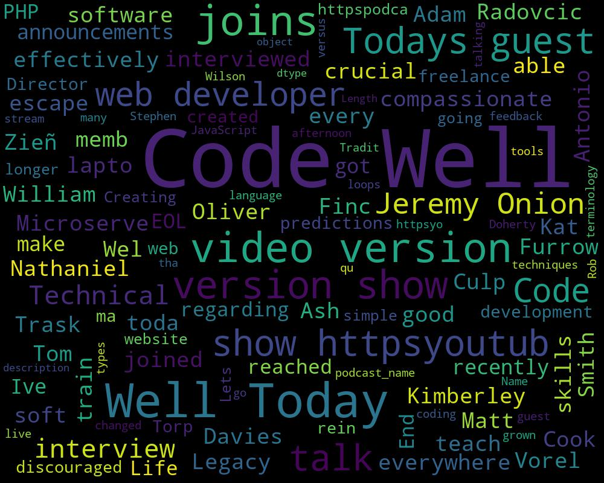
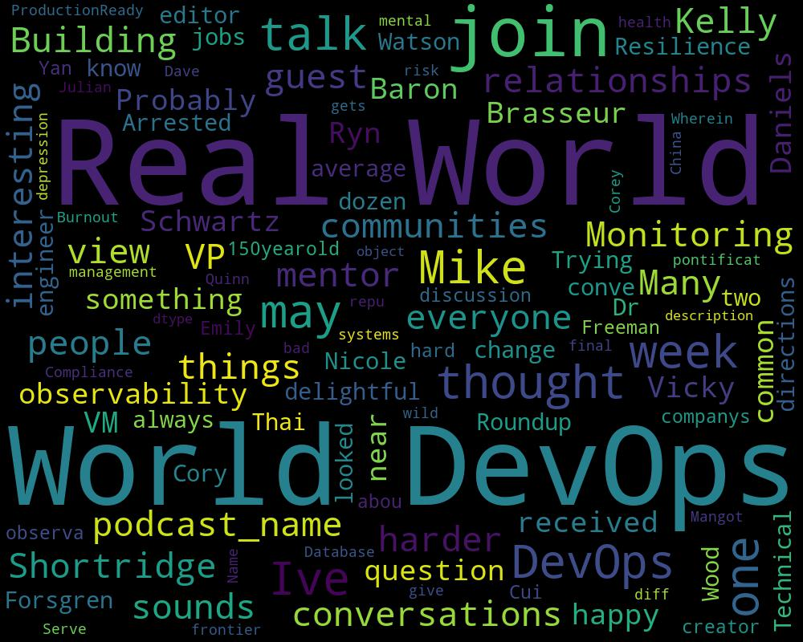

# Curated List of Python Podcasts
There are lots of great podcasts coming out these days. I wanted to compile a list of some of the great ones. This list contains only currently running podcasts (atleast 1 episode in the past month). I have also included some tangentially related podcasts that you may find interesting. You can find a Word Cloud Visualization associated with each podcast, which will hopefully give you an idea about the podcast contents. I hope you find this list useful :-)

## Talk Python To Me - Python conversations for passionate developers
### Latest Episode: 
 Title:  #216 Digging into Visual Studio Code

## Simple Programmer Podcast
### Latest Episode: 
 Title:  756 Is PYTHON The FUTURE Of Programming? (With Rafeh Qazi From Clever Programmer) - Simple Programmer Podcast

## Teaching Python
### Latest Episode: 
 Title:  Episode 22: Talking About Teaching With Meg Ray

## Five Things  - Channel 9
### Latest Episode: 
 Title:  Five Things You Didn't Know Python Could Do

## The Changelog
### Latest Episode: 
 Title:  The state of CSS in 2019

## AWS Podcast
### Latest Episode: 
 Title:  #316: Exploring AWS Lake Formation

## CircuitPython Weekly Meeting
### Latest Episode: 
 Title:  Adafruit CircuitPython Weekly - July 2nd, 2018 @adafruit #adafruit

## Adafruit Industries
### Latest Episode: 
 Title:  MakeCode Minute: Arcade Projectile Bounce @adafruit @johnedgarpark #adafruit @MSMakeCode #makecode

## How To Code Well
### Latest Episode: 
 Title:  S2 E25 Learning To Code After 30 - Stephen Doherty Interview 

## Real World DevOps
### Latest Episode: 
 Title:  Mentorship in Tech with Aaron Sachs

