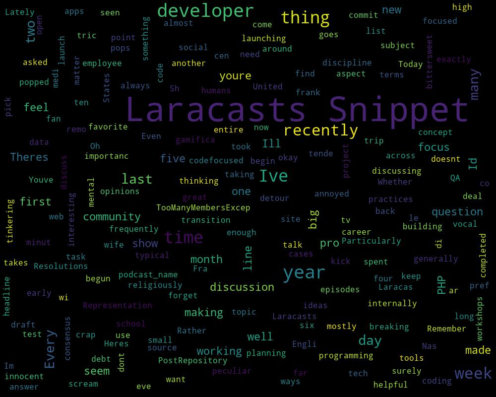

# Curated List of Web Development Podcasts
There are lots of great podcasts coming out these days. I wanted to compile a list of some of the great ones. This list contains only currently running podcasts (atleast 1 episode in the past month). I have also included some tangentially related podcasts that you may find interesting. You can find a Word Cloud Visualization associated with each podcast, which will hopefully give you an idea about the podcast contents. I hope you find this list useful :-)

## PHP Web Development Podcast with Mathew Kimani.
### Latest Episode: 
 Title:  EP#42 - Imposters Syndrome with Mark Bradley - Principle Software Engineer - Sainsbury’s.

## HTML All The Things - Web Development, Web Design, Small Business
### Latest Episode: 
 Title:  Migrations

## Relative Paths | Web Development and stuff like that
### Latest Episode: 
 Title:  56: Gimme the cash | Tinkling the ivories

## devMode.fm
### Latest Episode: 
 Title:  Una Kravets on Google Material Design & web trends

## Smart Web Creators
### Latest Episode: 
 Title:  Ready your Twitter for more business growth with Bridget Willard – SWC 37

 ## The 8Bit Podcast
### Latest Episode: 
 Title:  The 8Bit Podcast - Episode 029 - Role of Outbound in an Inbound Methodology

## The Polyglot Developer Podcast
### Latest Episode: 
 Title:  TPDP001: The Requirements for Building Mobile Applications

## Script & Style
### Latest Episode: 
 Title:  Getting a Job in Tech

## DevEd Podcast
### Latest Episode: 
 Title:  DevEd 017: What You Should Learn in 2019

## The Valerie V Show!
### Latest Episode: 
 Title:  Valerie V Show- 6 Ways to Get More Visibility, Authority, and Trust from your Audience

## egghead.io developer chats
### Latest Episode: 
 Title:  Figuring Out What's Next after Your Needs are Met - with Jason Lengstorf

## The Laracasts Snippet
### Latest Episode: 
 Title:  Gamification

## Remote Ruby
### Latest Episode: 
 Title:  Open Source Government Development in Rails with Charley Stran

## Localhost Podcast
### Latest Episode: 
 Title:  024 - Web Authentication

## Full Stack Cast
### Latest Episode: 
 Title:  Sarah Drasner: Change, dogma and growing as an engineer

## Real Talk JavaScript
### Latest Episode: 
 Title:  Episode 37: Founding the dev.to platform - Ben Halpern

## Talking Drupal
### Latest Episode: 
 Title:  Talking Drupal #215 - Component Base Theming

## How To Code Well
### Latest Episode: 
 Title:  S2 E25 Learning To Code After 30 - Stephen Doherty Interview 

## The CGD Podcast
### Latest Episode: 
 Title:  Sounds Robotic: A CGD Podcast – Amolo Ngweno

## INDE's Augmented Reality Podcast
### Latest Episode: 
 Title:  Ep. 20 - VR, AR, MR (and other acronyms)...what is the difference? - INDE's AR Podcast

## SDxCentral Weekly Wrap
### Latest Episode: 
 Title:  SDxCentral Weekly Wrap: VMware Dives Deeper Into Multi-Cloud Security With Secure State

## Syntax - Tasty Web Development Treats
### Latest Episode: 
 Title:  SVGs with Sara Soueidan

## Custom Ecommerce Web Development
### Latest Episode: 
 Title:  How to Improve Customer Experience in eCommerce

